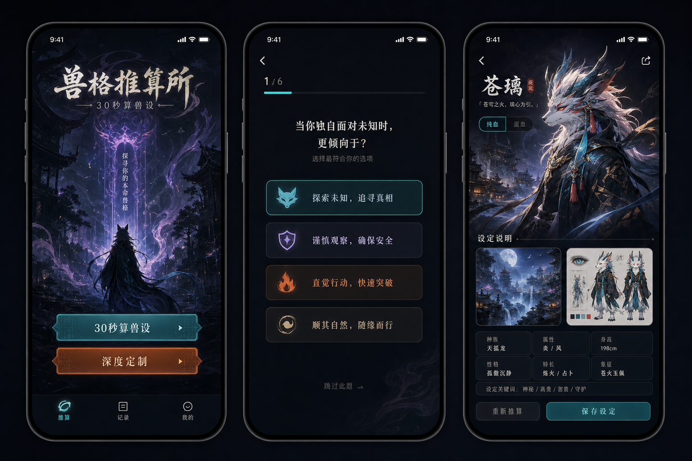
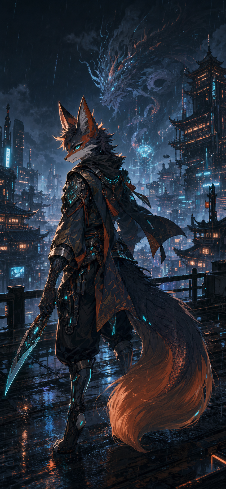
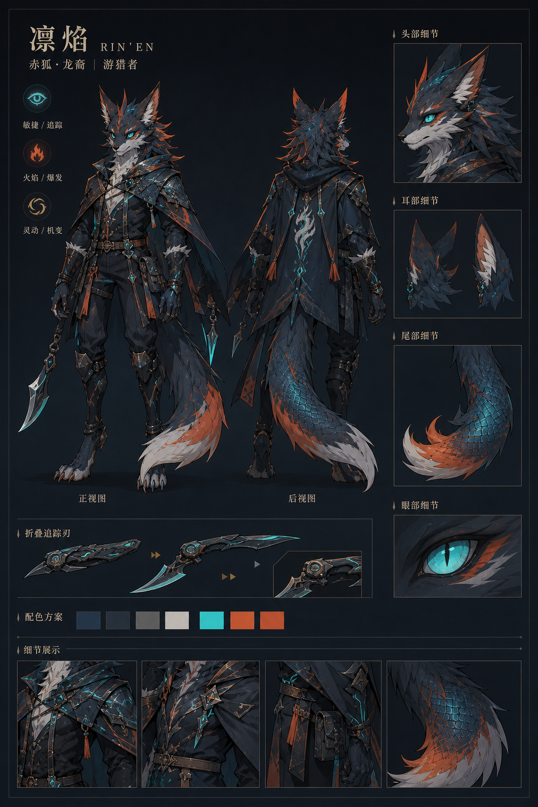

# Fursona Atelier

<p align="right">
  <strong>Language:</strong>
  <a href="./README.md">中文</a> |
  <a href="./README.en.md">English</a>
</p>

<p align="center">
  
</p>

<p align="center">
  
  
  
  
  
</p>

**Version:** V1.0.0<br>
**Author:** DingC<br>
**License:** [MIT](./LICENSE)

Fursona Atelier is a mobile-first AI fursona design tool. Users answer a subtle quick quiz or a deeper branching questionnaire to describe personality, aesthetics, world-building preferences, and design boundaries. The app first uses a local rule engine to infer species candidates, lineage, and conflicts, then calls OpenAI to generate a structured character spec, a complete scene image, and a multi-view reference sheet.

## Highlights

- **Mobile-first experience**: the main flow is designed for phone-sized interaction, with desktop acting as a centered preview.
- **Two quiz modes**: a fixed 12-question quick flow plus a deeper branching bank for detailed customization.
- **Subtle scoring**: users see narrative choices while the backend accumulates personality, aesthetic, world, material, lineage, and species signals.
- **Local rule engine**: creates a `scoreSnapshot`, species candidates, lineage recommendation, and conflict hints before AI generation.
- **Lineage control**: supports `AI recommended`, `pure`, and `hybrid` generation modes to reduce random trait mixing.
- **Two consistent image outputs**: the complete scene and reference sheet are derived from the same structured spec to reduce character drift.
- **Result actions**: save images, copy setting text, and retry a single image.

## Preview

| Complete Scene | Reference Sheet |
| --- | --- |
|  |  |

## Generation Flow

```text
Fixed Q12 or deep branching question bank
-> Local scoring engine creates scoreSnapshot
-> Pre-generation review and conflict detection
-> Rule engine infers species and lineage
-> OpenAI text model generates character_spec_json
-> Two image prompts are derived from the same JSON
-> OpenAI image model generates complete scene and reference sheet in parallel
-> Result page receives character spec, complete image, and reference image
```

## Tech Stack

- Next.js App Router
- React
- TypeScript
- Tailwind CSS
- OpenAI SDK
- Vitest
- ESLint

## Project Structure

```text
src/app/page.tsx                         Mobile UI and interaction flow
src/app/api/generate/route.ts            AI generation endpoint
src/app/api/regenerate-image/route.ts    Single-image retry endpoint
src/data/quickQuestions.ts               Fixed 12-question quick bank
src/data/deepQuestionBank.ts             Local deep branching question bank
src/data/species.ts                      Species mapping and weights
src/data/scoringRules.ts                 Combination boosts and lineage thresholds
src/lib/scoring.ts                       Local scoring engine
src/lib/questionFlow.ts                  Deep branch selector
src/lib/conflicts.ts                     Setting conflict detection
src/lib/fursona.ts                       Fursona rule inference and fallback spec
src/lib/openai.ts                        OpenAI SDK configuration
public/                                  Static images for GitHub and frontend use
assets/                                  Product visual references
docs/                                    PRD, question-bank, and implementation docs
```

## Local Setup

Copy the environment template:

```powershell
Copy-Item .env.local.example .env.local
```

Edit `.env.local`:

```env
OPENAI_API_KEY=sk-your-api-key-here
OPENAI_BASE_URL=https://api.openai.com/v1
OPENAI_TEXT_MODEL=gpt-4.1-mini
OPENAI_IMAGE_MODEL=gpt-image-2
```

`.env.local.example` contains GitHub-safe placeholder values only. The real `.env.local` file is ignored by `.gitignore`; do not commit your real key, custom base URL, or any secret.

Install dependencies and start the dev server:

```powershell
npm.cmd install
npm.cmd run dev
```

Open:

```text
http://localhost:3000
```

For a stable production preview:

```powershell
npm.cmd run build
npm.cmd run preview
```

## Commands

| Command | Description |
| --- | --- |
| `npm.cmd run dev` | Start the development server |
| `npm.cmd run build` | Build for production |
| `npm.cmd run preview` | Preview the production build on `127.0.0.1:3000` |
| `npm.cmd run start` | Start the built production app |
| `npm.cmd test` | Run Vitest |
| `npm.cmd run lint` | Run ESLint |

## API

### `POST /api/generate`

Generates the structured character spec, complete scene, and reference sheet. If `OPENAI_API_KEY` is missing, the endpoint returns a clear error instead of fake demo data.

### `POST /api/regenerate-image`

Receives an existing prompt and redraws one image without regenerating the character spec.

## Rule Summary

- The quick quiz uses 12 subtle questions. Options do not directly expose labels such as fox, dragon, cyber, or hybrid.
- Each answer has weak weights and usually affects 3-5 tags, so one answer cannot decide the final species.
- Strong results require tag combinations, such as `mystery + slim + fox` for fox candidates or `control + mythic_bias + scale` for dragon or qilin candidates.
- `Pure` keeps one primary species and blocks obvious secondary traits. `Hybrid` allows up to 3 lineages, with secondary traits mapped to concrete body parts, materials, or equipment.
- Image prompts enforce `no visible text, no character name, no labels, no typography, no watermark`.

## Not Included Yet

- Result persistence / history
- Community feed
- Multi-character relationship graph
- Fine-grained post-generation editing
- Inpainting / partial redraw
- Live2D / VTuber output
- Commission marketplace

## Notes

- Do not commit `.env.local`, API keys, or any secrets.
- If you use an OpenAI-compatible provider, make sure it supports both the Responses API and Images API.
- Image generation cost, latency, and final quality depend on the selected model and provider. `gpt-image-2` is recommended.
- Image quality variance, unstable details, or style drift are usually limitations of the image model rather than local rule inference errors.
- V1.0.0 focuses on the quick generation flow. The fine-grained question bank will continue to evolve in later versions.
